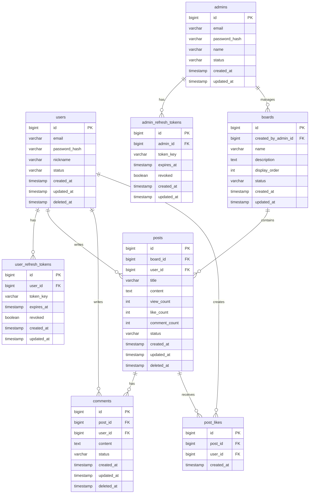

# 게시판 서비스 ERD

## 1. 문서 목적

이 문서는 `post` 서비스의 v1 요구사항을 기준으로 핵심 엔터티와 관계를 정의한다.
관리자 페이지는 존재하지만, 본 ERD에서는 UI 자체가 아니라 관리자 계정과 운영 대상 데이터 구조만 표현한다.

기준 범위:

- 회원/관리자 인증
- 게시판 관리
- 게시글
- 댓글
- 좋아요
- 운영 상태 관리

---

## 2. Mermaid ERD

---

## 3. 엔터티 정의

| 테이블명 | 설명 | PK | 주요 FK | 핵심 컬럼 |
| --- | --- | --- | --- | --- |
| `users` | 일반 사용자 계정 | `id` | - | `email`, `password_hash`, `nickname`, `status`, `deleted_at`, `created_at`, `updated_at` |
| `admins` | 관리자 계정 | `id` | - | `email`, `password_hash`, `name`, `status`, `created_at`, `updated_at` |
| `user_refresh_tokens` | 일반 사용자 Refresh Token 저장 | `id` | `user_id -> users.id` | `token_key`, `expires_at`, `revoked`, `created_at`, `updated_at` |
| `admin_refresh_tokens` | 관리자 Refresh Token 저장 | `id` | `admin_id -> admins.id` | `token_key`, `expires_at`, `revoked`, `created_at`, `updated_at` |
| `boards` | 게시판 마스터 | `id` | `created_by_admin_id -> admins.id` | `name`, `description`, `display_order`, `status`, `created_at`, `updated_at` |
| `posts` | 게시글 본문과 게시 상태 | `id` | `board_id -> boards.id`, `user_id -> users.id` | `title`, `content`, `view_count`, `like_count`, `comment_count`, `status`, `deleted_at`, `created_at`, `updated_at` |
| `comments` | 게시글 댓글 | `id` | `post_id -> posts.id`, `user_id -> users.id` | `content`, `status`, `deleted_at`, `created_at`, `updated_at` |
| `post_likes` | 게시글 좋아요 이력 | `id` | `post_id -> posts.id`, `user_id -> users.id` | `created_at`, unique `post_id + user_id` |

---

## 4. 관계 요약

| 관계명 | 카디널리티 | 설명 |
| --- | --- | --- |
| `users -> user_refresh_tokens` | `1:N` | 일반 사용자 한 명은 여러 Refresh Token을 가질 수 있다. |
| `admins -> admin_refresh_tokens` | `1:N` | 관리자 한 명은 여러 Refresh Token을 가질 수 있다. |
| `admins -> boards` | `1:N` | 관리자는 여러 게시판을 생성하거나 관리할 수 있다. |
| `boards -> posts` | `1:N` | 게시판 하나에는 여러 게시글이 속한다. |
| `users -> posts` | `1:N` | 일반 사용자는 여러 게시글을 작성할 수 있다. |
| `posts -> comments` | `1:N` | 게시글 하나에는 여러 댓글이 달릴 수 있다. |
| `users -> comments` | `1:N` | 일반 사용자는 여러 댓글을 작성할 수 있다. |
| `posts -> post_likes` | `1:N` | 게시글 하나에는 여러 좋아요가 누적될 수 있다. |
| `users -> post_likes` | `1:N` | 일반 사용자는 여러 게시글에 좋아요를 남길 수 있다. |

---

## 5. 설계 메모

- 관리자 로그인 요구사항을 반영하기 위해 `users`와 `admins`를 분리했다.
- 관리자 대시보드는 별도 저장 테이블 없이 `boards`, `posts`, `comments` 집계 조회로 구성한다.
- 운영 관리 요구사항은 별도 이력 테이블 없이 `posts.status`, `comments.status`, `deleted_at` 중심으로 처리한다.
- `post_likes`는 중복 좋아요 방지를 위해 `(post_id, user_id)` 복합 유니크 제약을 둔다.
- `view_count`, `like_count`, `comment_count`는 목록/상세 조회 성능을 위한 카운트 캐시 컬럼이다.

## 6. v1 제외 범위 반영 메모

아래 기능은 요구사항에서 제외되었으므로 본 ERD에도 포함하지 않는다.

- 대댓글, 멘션, 답글 트리 구조
- 첨부파일, 이미지, 영상 업로드
- 공지사항, 상단 고정, 강조 게시글
- 신고 접수, 신고 사유 관리, 제재 이력 관리
- 알림, 북마크, 구독, 팔로우
- 실시간 기능과 별도 운영 이력 테이블
