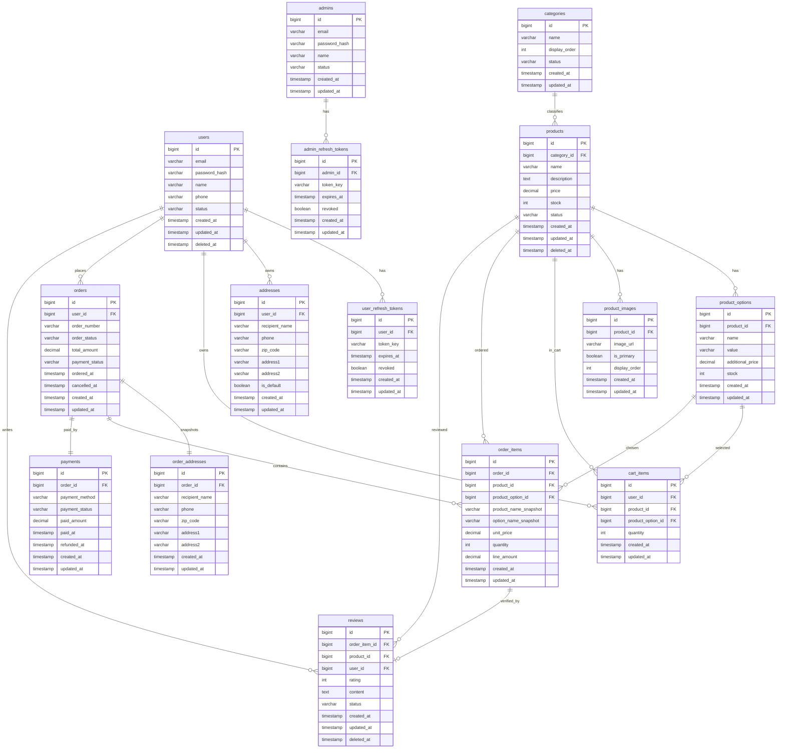

# 쇼핑몰 서비스 ERD

## 1. 문서 목적

이 문서는 `shop` 서비스의 v1 요구사항을 기준으로 핵심 엔터티와 관계를 정의한다.
관리자 페이지는 존재하지만, 본 ERD에서는 UI 자체가 아니라 관리자 계정과 운영 대상 데이터 구조만 표현한다.

기준 범위:

- 회원/관리자 인증
- 카테고리
- 상품/옵션/이미지
- 장바구니
- 배송지
- 주문
- 결제
- 리뷰

---

## 2. Mermaid ERD

---

## 3. 엔터티 정의

| 테이블명 | 설명 | PK | 주요 FK | 핵심 컬럼 |
| --- | --- | --- | --- | --- |
| `users` | 일반 사용자 계정 | `id` | - | `email`, `password_hash`, `name`, `phone`, `status`, `deleted_at`, `created_at`, `updated_at` |
| `admins` | 관리자 계정 | `id` | - | `email`, `password_hash`, `name`, `status`, `created_at`, `updated_at` |
| `user_refresh_tokens` | 일반 사용자 Refresh Token 저장 | `id` | `user_id -> users.id` | `token_key`, `expires_at`, `revoked`, `created_at`, `updated_at` |
| `admin_refresh_tokens` | 관리자 Refresh Token 저장 | `id` | `admin_id -> admins.id` | `token_key`, `expires_at`, `revoked`, `created_at`, `updated_at` |
| `categories` | 상품 카테고리 마스터 | `id` | - | `name`, `display_order`, `status`, `created_at`, `updated_at` |
| `products` | 상품 기본 정보 | `id` | `category_id -> categories.id` | `name`, `description`, `price`, `stock`, `status`, `deleted_at`, `created_at`, `updated_at` |
| `product_options` | 상품 옵션 | `id` | `product_id -> products.id` | `name`, `value`, `additional_price`, `stock`, `created_at`, `updated_at` |
| `product_images` | 상품 이미지 | `id` | `product_id -> products.id` | `image_url`, `is_primary`, `display_order`, `created_at`, `updated_at` |
| `cart_items` | 사용자 장바구니 항목 | `id` | `user_id -> users.id`, `product_id -> products.id`, `product_option_id -> product_options.id` | `quantity`, `created_at`, `updated_at` |
| `addresses` | 사용자 배송지 | `id` | `user_id -> users.id` | `recipient_name`, `phone`, `zip_code`, `address1`, `address2`, `is_default`, `created_at`, `updated_at` |
| `orders` | 주문 헤더 | `id` | `user_id -> users.id` | `order_number`, `order_status`, `total_amount`, `payment_status`, `ordered_at`, `cancelled_at`, `created_at`, `updated_at` |
| `order_addresses` | 주문 시점 배송지 스냅샷 | `id` | `order_id -> orders.id` | `recipient_name`, `phone`, `zip_code`, `address1`, `address2`, `created_at`, `updated_at` |
| `order_items` | 주문 상품 라인 | `id` | `order_id -> orders.id`, `product_id -> products.id`, `product_option_id -> product_options.id` | `product_name_snapshot`, `option_name_snapshot`, `unit_price`, `quantity`, `line_amount`, `created_at`, `updated_at` |
| `payments` | 주문 결제 정보 | `id` | `order_id -> orders.id` | `payment_method`, `payment_status`, `paid_amount`, `paid_at`, `refunded_at`, `created_at`, `updated_at` |
| `reviews` | 구매 검증 기반 상품 리뷰 | `id` | `order_item_id -> order_items.id`, `product_id -> products.id`, `user_id -> users.id` | `rating`, `content`, `status`, `deleted_at`, `created_at`, `updated_at` |

---

## 4. 관계 요약

| 관계명 | 카디널리티 | 설명 |
| --- | --- | --- |
| `users -> user_refresh_tokens` | `1:N` | 일반 사용자 한 명은 여러 Refresh Token을 가질 수 있다. |
| `admins -> admin_refresh_tokens` | `1:N` | 관리자 한 명은 여러 Refresh Token을 가질 수 있다. |
| `users -> addresses` | `1:N` | 일반 사용자는 여러 배송지를 등록할 수 있다. |
| `categories -> products` | `1:N` | 카테고리 하나에는 여러 상품이 속한다. |
| `products -> product_options` | `1:N` | 상품 하나에는 여러 옵션이 존재할 수 있다. |
| `products -> product_images` | `1:N` | 상품 하나에는 여러 이미지가 연결될 수 있다. |
| `users -> cart_items` | `1:N` | 일반 사용자는 여러 장바구니 항목을 가질 수 있다. |
| `products -> cart_items` | `1:N` | 하나의 상품은 여러 장바구니 항목에 담길 수 있다. |
| `product_options -> cart_items` | `1:N` | 하나의 옵션은 여러 장바구니 항목에서 선택될 수 있다. |
| `users -> orders` | `1:N` | 일반 사용자는 여러 주문을 생성할 수 있다. |
| `orders -> order_addresses` | `1:1` | 주문 하나는 주문 시점 배송지 스냅샷 하나를 가진다. |
| `orders -> order_items` | `1:N` | 주문 하나에는 여러 주문 상품 라인이 포함된다. |
| `products -> order_items` | `1:N` | 하나의 상품은 여러 주문 상품 라인에 포함될 수 있다. |
| `product_options -> order_items` | `1:N` | 하나의 옵션은 여러 주문 상품 라인에서 참조될 수 있다. |
| `orders -> payments` | `1:1` | 주문 하나는 하나의 결제 레코드를 가진다. |
| `users -> reviews` | `1:N` | 일반 사용자는 여러 리뷰를 작성할 수 있다. |
| `products -> reviews` | `1:N` | 상품 하나에는 여러 리뷰가 달릴 수 있다. |
| `order_items -> reviews` | `1:0..1` | 주문 상품 라인 하나에는 최대 하나의 리뷰가 연결된다. |

---

## 5. 설계 메모

- 관리자 로그인 요구사항을 반영하기 위해 `users`와 `admins`를 분리했다.
- 관리자 대시보드는 별도 저장 테이블 없이 `orders`, `products`, `users`, `reviews` 집계 조회로 구성한다.
- 주문 배송지는 사용자의 현재 배송지와 분리하기 위해 `order_addresses` 스냅샷 테이블로 보관한다.
- 리뷰는 실제 구매 검증을 위해 `order_items`에 연결한다.
- 운영 이력은 v1에서 별도 history 테이블 없이 `status`, `deleted_at`, `cancelled_at` 중심으로 처리한다.
- `product_option_id`는 옵션 없는 상품 주문을 위해 nullable 로 해석할 수 있다.

## 6. v1 제외 범위 반영 메모

아래 기능은 요구사항에서 제외되었으므로 본 ERD에도 포함하지 않는다.

- 판매자 계정, 판매처 관리, 판매처별 가격 관리
- 가격 비교, 가격 추이, 가격 알림
- 위시리스트, 포인트, 쿠폰, 적립금
- 상품 문의, 고객센터, FAQ, 공지사항
- 채팅, 푸시 알림, 추천, 랭킹
- 커뮤니티, 게시판, 활동 내역
- 고급 운영 분석, 광고/프로모션, 별도 운영 이력 테이블
